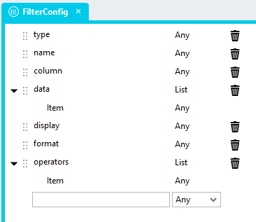

# Filter Grid Generator <!-- omit in toc -->

A module to generate sets of filters and to filter JSON arrays. This module enables for four separate functions:

1. Generating filters grids
2. Applying sets of filters to JSON arrays
3. Resetting / clearing filtergrids
4. Populating filtergrids from sets of saved filters

This module can be used in conjunction with DataGrids and [Client-Side Repeater DataGrids](https://github.com/stadium-software/repeater-datagrid-client-side) alike. Use this script with smaller datasets instead of the similar [DataGrid Advanced Search](https://github.com/stadium-software/datagrid-advanced-search). 

If you are using this module in connection with a [Client-Side Repeater DataGrid](https://github.com/stadium-software/repeater-datagrid-client-side) set up all elements necessary for the [Client-Side Repeater DataGrid](https://github.com/stadium-software/repeater-datagrid-client-side) before adding this filter grid module. 

https://github.com/user-attachments/assets/fbd26ac9-1c81-4a2a-9980-18d585c7f125

## Contents <!-- omit in toc -->
- [Version](#version)
- [Setup](#setup)
  - [Application](#application)
  - [Global Scripts](#global-scripts)
    - [GenerateFilters Script](#generatefilters-script)
    - [ApplyFilters Script](#applyfilters-script)
    - [ClearFilters Script](#clearfilters-script)
    - [SetFilters Script](#setfilters-script)
  - [Types](#types)
    - [FilterConfig Type Setup (Required)](#filterconfig-type-setup-required)
    - [SelectedFilters Type Setup (Optional)](#selectedfilters-type-setup-optional)
  - [Page](#page)
  - [Event Handlers](#event-handlers)
    - [Page.Load](#pageload)
    - [Apply Button Click](#apply-button-click)
    - [Clear Filters Button Click](#clear-filters-button-click)
  - [Saved Filters](#saved-filters)
    - [Saving Filters](#saving-filters)
    - [Applying Saved Filters](#applying-saved-filters)
  - [Display Options](#display-options)
    - [Collapsible](#collapsible)
  - [CSS](#css)
    - [Before v6.12](#before-v612)
    - [v6.12+](#v612)
    - [Customising CSS](#customising-css)
  - [Upgrading Stadium Repos](#upgrading-stadium-repos)

# Version
1.1

1.0.1 Changed px to rem; upgraded readme to 6.12+

1.0.2 Fixed alignment issue for last input field in grid (css only)

1.0.2.1 Fixed dropdown width bug (css only)

1.1 Adjusted display width for enum, boolean, radiobuttonlist and checkboxlist displays

1.1.1 CSS operator width layout adjustment

1.2 Fixed re-initialise bug

1.2.1 ApplyFilters script returns error when input data is not a List or Array

# Setup

## Application 
1. Check the *Enable Style Sheet* checkbox in the application properties

## Global Scripts
This module requires the creation of four separate scripts. Each of these can be called separately, providing for flexibility in implementation. 

1. [GenerateFilters](#generatefilters-script): Generates the filtergrid from the configuration
2. [ApplyFilters](#applyfilters-script): Parses the filtergrid and applies the filters to a dataset
3. [ClearFilters](#clearfilters-script): Resets the filtergrid
4. [SetFilters](#setfilters-script): Populates a filtergrid with filter values from a set of saved filters

### GenerateFilters Script
1. Create a Global Script called "GenerateFilters"
2. Add the input parameters below to the Global Script
   1. FilterConfig
   2. FilterContainerClass
3. Drag a *JavaScript* action into the script
4. Add the Javascript below into the JavaScript code property
```javascript
/* Stadium Script 1.2 https://github.com/stadium-software/filter-grid */
let filterClassName = "." + ~.Parameters.Input.FilterContainerClass;
let filterConfig = ~.Parameters.Input.FilterConfig;
const insert = (arr, index, newItem) => [...arr.slice(0, index), newItem, ...arr.slice(index)];
let numberSelectChange = (e) => {
    let target = e.target;
    let toEl = target.closest("div").nextElementSibling.querySelector(".filtergrid-to-number");
    let fromEl = target.closest("div").nextElementSibling.querySelector(".filtergrid-from-number");
    if (target.value != "Between" && target.value != "From-To") {
        toEl.classList.add("visually-hidden");
        toEl.value = "";
        fromEl.setAttribute("placeholder", "Value");
    } else { 
        toEl.classList.remove("visually-hidden");
        fromEl.setAttribute("placeholder", "From value");
    }
};
let dateSelectChange = (e) => {
    let target = e.target;
    let toEl = target.closest("div").nextElementSibling.querySelector(".filtergrid-to-date");
    let fromEl = target.closest("div").nextElementSibling.querySelector(".filtergrid-from-date");
    let targetVal = target.value.toLowerCase();
    if (targetVal == "greater than" || targetVal == "smaller than" || targetVal == "equals") {
        toEl.classList.add("visually-hidden");
        toEl.value = "";
        fromEl.setAttribute("placeholder", "Date");
    } else { 
        toEl.classList.remove("visually-hidden");
        fromEl.setAttribute("placeholder", "From date");
    }
};
let filterContainer = document.querySelectorAll(filterClassName);
if (filterContainer.length == 0) {
    console.error("The container for the filter was not found. Drag a container control into the page and assign the class '" + filterClassName + "' to it.");
    return false;
} else if (filterContainer.length > 1) {
    console.error("The class '" + filterClassName + "' is assigned to multiple controls. Assign a unique classname to the filter container");
    return false;
}
filterContainer = filterContainer[0];
filterContainer.classList.add("stadium-filter-container");
let filterInnerContainer = filterContainer.querySelector(".stadium-filter-inner-container");
if (filterInnerContainer) {
    filterInnerContainer.remove();
}
filterInnerContainer = document.createElement("div");
filterInnerContainer.classList.add("stadium-filter-inner-container");
filterContainer.appendChild(filterInnerContainer);
let stadiumFilters = document.createElement("div");
stadiumFilters.classList.add("stadium-filters");
filterInnerContainer.appendChild(stadiumFilters);
initFilterForm();

function initFilterForm() {
    for (let i = 0; i < filterConfig.length; i++) {
        let column = filterConfig[i].column;
        let colNo;
        let type = filterConfig[i].type;
        let name = filterConfig[i].name;
        let data = filterConfig[i].data;
        let display = filterConfig[i].display;
        let format = filterConfig[i].format;
        let operators = filterConfig[i].operators || [];
        operators = operators.map(v => v.toLowerCase());

        let label = document.createElement("div");
        label.classList.add("control-container","label-container");
        let labelInner = document.createElement("span");
        labelInner.textContent = name;
        label.appendChild(labelInner);

        let operator = document.createElement("div");
        let valueField = document.createElement("div");
        let select, input;

        if (type == "text") {
            select = document.createElement("select");
            let options = ["Contains", "Does not contain", "Equals", "Does not equal"];
            for (let s = 0; s < options.length; s++) {
                let opt = options[s];
                if (operators.includes(opt.toLowerCase()) || operators.length == 0) {
                    let el = document.createElement("option");
                    el.textContent = opt;
                    el.value = opt;
                    select.appendChild(el);
                }
            }
            if (operators.length == 1) select.setAttribute("readonly", "readonly");
            select.classList.add("form-control", "filter-operator");
            operator.classList.add("control-container", "drop-down-container");
            input = document.createElement("input");
            input.classList.add("form-control", "text-box-input", "filtergrid-text-value");
            input.setAttribute("placeholder", "Text");
            valueField.classList.add("control-container", "text-box-container");
        }
        if (type == "number") {
            select = document.createElement("select");
            let options = ["From-To", "Between", "Equals", "Greater than", "Smaller than"];
            for(let s = 0; s < options.length; s++) {
                let opt = options[s];
                if (operators.includes(opt.toLowerCase()) || operators.length == 0) {
                    let el = document.createElement("option");
                    el.textContent = opt;
                    el.value = opt;
                    select.appendChild(el);
                }
            }
            if (operators.length == 1) select.setAttribute("readonly", "readonly");
            select.classList.add("form-control", "filter-operator");
            operator.classList.add("control-container", "drop-down-container");
            let numInput1 = document.createElement("input");
            numInput1.classList.add("form-control", "text-box-input", "filtergrid-from-number");
            numInput1.setAttribute("placeholder", "From value");
            let numInput2 = document.createElement("input");
            numInput2.classList.add("form-control", "text-box-input", "filtergrid-to-number");
            numInput2.setAttribute("placeholder", "To value");
            input = document.createElement("div");
            input.classList.add("number-values");
            select.addEventListener("change", numberSelectChange);
            input.appendChild(numInput1);
            input.appendChild(numInput2);
        }
        if (type == "date") {
            if (!format) format = 'YYYY/MM/DD';
            select = document.createElement("select");
            let options = ["From-To", "Between", "Equals", "Greater than", "Smaller than"];
            for(let s = 0; s < options.length; s++) {
                let opt = options[s];
                if (operators.includes(opt.toLowerCase()) || operators.length == 0) {
                    let el = document.createElement("option");
                    el.textContent = opt;
                    el.value = opt;
                    select.appendChild(el);
                }
            }
            if (operators.length == 1) select.setAttribute("readonly", "readonly");
            select.classList.add("form-control", "filter-operator");
            operator.classList.add("control-container", "drop-down-container");
            let dtInput1 = document.createElement("input");
            dtInput1.classList.add("form-control", "text-box-input", "filtergrid-from-date");
            dtInput1.setAttribute("placeholder", "From date");
            dtInput1.setAttribute("format", format);
            let dtInput2 = document.createElement("input");
            dtInput2.classList.add("form-control", "text-box-input", "filtergrid-to-date");
            dtInput2.setAttribute("placeholder", "To date");
            if (display == "picker") {
                dtInput1.type = "date";
                dtInput2.type = "date";
            }
            input = document.createElement("div");
            input.classList.add("date-values");
            select.addEventListener("change", dateSelectChange);
            input.appendChild(dtInput1);
            input.appendChild(dtInput2);
        }
        if (type == "boolean") {
            if (!data) {
                data = ["Show all", "Yes", "No" ];
            }
            if (!data.includes('Show all')) data = insert(data, 0, "Show all");
            if (display == "dropdown") {
                select = document.createElement("select");
                for(let s = 0; s < data.length; s++) {
                    let opt = data[s];
                    let el = document.createElement("option");
                    el.textContent = opt;
                    el.value = opt;
                    el.text = opt;
                    select.appendChild(el);
                }
                select.classList.add("form-control");
                operator.classList.add("control-container", "drop-down-container", "filtergrid-boolean-operator", "span-2");
            } else {
                select = document.createElement("div");
                for (let s = 0; s < data.length; s++) {
                    let cont = document.createElement("div");
                    cont.classList.add("radio");
                    let opt = data[s];
                    let el = document.createElement("input");
                    let lab = document.createElement("label");
                    el.type = "radio";
                    el.name = column;
                    el.checked = false;
                    if (opt == "Show all") el.checked = true;
                    el.value = opt;
                    el.text = opt;
                    lab.textContent = opt;
                    el.id = column + "_" + opt.replaceAll(" ", "").toLowerCase();
                    lab.setAttribute("for", el.id);
                    cont.appendChild(el);
                    cont.appendChild(lab);
                    select.appendChild(cont);
                }
                operator.classList.add("control-container", "radio-button-list-container", "filtergrid-radiobutton-list", "span-2");
            }
            input = document.createElement("div");
            valueField.classList.add("no-display");
        }
        if (type == "enum") {
            data = insert(data, 0, "Show all");
            if (display == "radio") {
                select = document.createElement("div");
                for (let s = 0; s < data.length; s++) {
                    let cont = document.createElement("div");
                    cont.classList.add("radio");
                    let opt = data[s];
                    let el = document.createElement("input");
                    let lab = document.createElement("label");
                    el.type = "radio";
                    el.name = column;
                    el.checked = false;
                    if (opt == "Show all") el.checked = true;
                    el.value = opt;
                    lab.textContent = opt;
                    let fid = column + "_" + opt;
                    el.id = fid.replaceAll(" ", "").toLowerCase();
                    lab.setAttribute("for", el.id);
                    cont.appendChild(el);
                    cont.appendChild(lab);
                    select.appendChild(cont);
                }
                operator.classList.add("control-container", "radio-button-list-container", "filtergrid-radiobutton-list", "span-2");
            } else {
                select = document.createElement("select");
                for (let s = 0; s < data.length; s++) {
                    let opt = data[s];
                    let el = document.createElement("option");
                    el.textContent = opt;
                    el.value = opt;
                    select.appendChild(el);
                }
                select.classList.add("form-control");
                operator.classList.add("control-container", "drop-down-container", "filtergrid-enum-operator", "span-2");
            }
            input = document.createElement("div");
            valueField.classList.add("no-display");
        }
        if (type == "multiselect") {
            select = document.createElement("div");
            for (let s = 0; s < data.length; s++) {
                let cont = document.createElement("div");
                cont.classList.add("checkbox");
                let opt = data[s];
                let el = document.createElement("input");
                let lab = document.createElement("label");
                el.type = "checkbox";
                el.checked = false;
                el.value = opt;
                lab.textContent = opt;
                let fid = column + "_" + opt;
                el.id = fid.replaceAll(" ", "").toLowerCase();
                lab.setAttribute("for", el.id);
                cont.appendChild(el);
                cont.appendChild(lab);
                select.appendChild(cont);
            }
            operator.classList.add("control-container", "check-box-list-container", "filtergrid-checkbox-list", "span-2");
            input = document.createElement("div");
            valueField.classList.add("no-display");
        }
        setAttributes(operator, { "foperator": column, "ftype": type, "cno": colNo, "fdisplay": display });
        operator.appendChild(select);

        setAttributes(valueField, { "fvalue": column, "ftype": type, "cno": colNo, "fdisplay": display });
        valueField.appendChild(input);

        stadiumFilters.appendChild(label);
        stadiumFilters.appendChild(operator);
        stadiumFilters.appendChild(valueField);
        select.dispatchEvent(new Event('change'));
    }
}
function setAttributes(el, attrs) {
  for(var key in attrs) {
    el.setAttribute(key, attrs[key]);
  }
}
```

### ApplyFilters Script
1. Create a Global Script called "ApplyFilters"
2. Add the input parameters below to the Global Script
   1. Data
   2. FilterContainerClass
3. Add the output parameters below to the Global Script
   1. Data
4. Drag a *JavaScript* action into the script
5. Add the Javascript below into the JavaScript code property
6. Drag a *SetValue* action below the JavaScript code action
   1. Target: ~.Parameters.Output.Data
   2. Source: ~.JavaScript
```javascript
/* Stadium Script 1.1 https://github.com/stadium-software/filter-grid */
let filterClassName = "." + ~.Parameters.Input.FilterContainerClass;
let data = ~.Parameters.Input.Data || [];
if (!Array.isArray(data)) {
    console.error("The *Data* parameter must be a List or Array.");
    return {data: data, filters: []};
}
let filterContainer = document.querySelectorAll(filterClassName);
if (filterContainer.length == 0) {
    console.error("A container with the class '" + filterClassName + "' was not found.");
    return false;
} else if (filterContainer.length > 1) {
    console.error("The class '" + filterClassName + "' is assigned to multiple controls.");
    return false;
}
filterContainer = filterContainer[0];
let res = filterRepeaterData();
return res;
/*-----------------------------*/
function filterRepeaterData(){
    let returnData = data;
    let arrReturn = [];
    let operatorEls = filterContainer.querySelectorAll(".stadium-filters [foperator]");
    for (let i = 0; i < operatorEls.length; i++) {
        let ftype = operatorEls[i].getAttribute("ftype");
        let fdisplay = operatorEls[i].getAttribute("fdisplay");
        let foperator = operatorEls[i].getAttribute("foperator");
        let fvalueEl = operatorEls[i].nextElementSibling;
        if (ftype == "text") {
            let txtoperator = operatorEls[i].querySelector("select").value;
            let txtvalue = fvalueEl.querySelector("input").value;
            if (txtvalue) {
                if (txtoperator.toLowerCase() == "contains") {
                    returnData = contains(returnData, foperator, txtvalue);
                } else if (txtoperator.toLowerCase() == "does not contain") {
                    returnData = notcontains(returnData, foperator, txtvalue);
                } else if (txtoperator.toLowerCase() == "equals") {
                    returnData = equals(returnData, foperator, txtvalue);
                } else if (txtoperator.toLowerCase() == "does not equal") {
                    returnData = notequals(returnData, foperator, txtvalue);
                }
                arrReturn.push({ "column": foperator, "selectedoperator": txtoperator, selectedvalues: [txtvalue] });
            }
        }
        if (ftype == "number") {
            let numoperator = operatorEls[i].querySelector("select").value;
            let numvaluefromEl = fvalueEl.querySelector(".filtergrid-from-number");
            let numvaluetoEl = fvalueEl.querySelector(".filtergrid-to-number");
            let numvaluefrom = numvaluefromEl.value;
            let numvalueto = numvaluetoEl.value;
            if (numvaluefrom) {
                if (!numvaluefrom) numvaluefrom = -9007199254740991;
                if (!numvalueto) numvalueto = 9007199254740991;
                numvaluefromEl.value = numvaluefrom;
                numvaluetoEl.value = numvalueto;
                if (numoperator.toLowerCase() == "between") {
                    returnData = betweenNumbers(returnData, foperator, numvaluefrom, numvalueto);
                } else if (numoperator.toLowerCase() == "from-to") {
                    returnData = fromtoNumbers(returnData, foperator, numvaluefrom, numvalueto);
                } else if (numoperator.toLowerCase() == "equals") {
                    returnData = equals(returnData, foperator, numvaluefrom);
                } else if (numoperator.toLowerCase() == "greater than") {
                    returnData = greaterNumbers(returnData, foperator, numvaluefrom);
                } else if (numoperator.toLowerCase() == "smaller than") {
                    returnData = smallerNumbers(returnData, foperator, numvaluefrom);
                }
                arrReturn.push({"column": foperator, "selectedoperator":numoperator, selectedvalues: [numvaluefrom, numvalueto]});
            }
        }
        if (ftype == "date") {
            let dtoperator = operatorEls[i].querySelector("select").value;
            let fromEl = fvalueEl.querySelector(".filtergrid-from-date");
            let toEl = fvalueEl.querySelector(".filtergrid-to-date");
            let format = fromEl.getAttribute("format");
            if (fromEl.value) {
                let dtvaluefrom = dayjs(fromEl.value).format(format);
                let dtvalueto = dayjs(toEl.value).format(format);
                if (dtvaluefrom == "Invalid Date") dtvaluefrom = dayjs('1000/01/01').format(format);
                if (dtvalueto == "Invalid Date") dtvalueto = dayjs('3000/01/01').format(format);
                if (fromEl.type == "date") {
                    fromEl.value = dayjs(dtvaluefrom).format('YYYY-MM-DD');
                    toEl.value = dayjs(dtvalueto).format('YYYY-MM-DD');
                } else {
                    fromEl.value = dtvaluefrom;
                    toEl.value = dtvalueto;
                }
                if (dtoperator.toLowerCase() == "between") {
                    returnData = betweenDates(returnData, foperator, dtvaluefrom, dtvalueto, format);
                } else if (dtoperator.toLowerCase() == "from-to") {
                    returnData = fromtoDates(returnData, foperator, dtvaluefrom, dtvalueto, format);
                } else if (dtoperator.toLowerCase() == "equals") {
                    returnData = equalsDate(returnData, foperator, dtvaluefrom, format);
                } else if (dtoperator.toLowerCase() == "greater than") {
                    returnData = greaterDates(returnData, foperator, dtvaluefrom, format);
                } else if (dtoperator.toLowerCase() == "smaller than") {
                    returnData = smallerDates(returnData, foperator, dtvaluefrom, format);
                }
                arrReturn.push({"column": foperator, "selectedoperator":dtoperator, selectedvalues: [dtvaluefrom, dtvalueto]});
            }
        }
        let selectedvals = [];
        if (ftype == "boolean" && fdisplay == "dropdown") {
            let booloperator = operatorEls[i].querySelector("select").value;
            if (booloperator != "Show all" && booloperator != "") {
                returnData = equals(returnData, foperator, /^(true|yes|1)$/i.test(booloperator.toLowerCase()));
                selectedvals.push(booloperator);
            }
        } else if (ftype == "boolean") {
            let multioperator = operatorEls[i].querySelector("input[type='radio']:checked");
            if (multioperator.value != "Show all") {
                returnData = equals(returnData, foperator, /^(true|yes|1)$/i.test(multioperator.value.toLowerCase()));
                selectedvals.push(multioperator.value);
            }
        }
        if (ftype == "enum" && fdisplay == "radio") {
            let multioperator = operatorEls[i].querySelector("input[type='radio']:checked");
            if (multioperator.value != "Show all") {
                returnData = equals(returnData, foperator, multioperator.value);
                selectedvals.push(multioperator.value);
            }
        } else if (ftype == "enum") {
            let enumoperator = operatorEls[i].querySelector("select").value;
            if (enumoperator != "Show all" && enumoperator != "") {
                returnData = equals(returnData, foperator, enumoperator);
                selectedvals.push(enumoperator);
            }
        }
        if (ftype == "multiselect") {
            let multioperator = operatorEls[i].querySelectorAll("input[type='checkbox']:checked");
            for (let s = 0; s < multioperator.length; s++) {
                selectedvals.push(multioperator[s].value);
            }
            if (multioperator.length > 0) returnData = inArray(returnData, foperator, selectedvals);
        }
        if (selectedvals.length > 0) arrReturn.push({ "column": foperator, selectedvalues: selectedvals });
    }
    filterContainer.classList.remove("expand");
    return {data: returnData, filters: arrReturn};
}
function contains(d, f, v) {
    return d.filter(el => el[f].indexOf(v) > -1 && el[f] !== undefined);
}
function notcontains(d, f, v) {
    return d.filter(el => el[f] === undefined || el[f].indexOf(v) == -1);
}
function equals(d, f, v) {
    return d.filter(el => el[f] == v && el[f] !== undefined);
}
function notequals(d, f, v) {
    return d.filter(el => el[f] === undefined || el[f] != v);
}
function betweenNumbers(d, f, v1, v2) {
    return d.filter(el => el[f] > v1 && el[f] < v2 && el[f] !== undefined);
}
function fromtoNumbers(d, f, v1, v2) {
    return d.filter(el => el[f] >= v1 && el[f] <= v2 && el[f] !== undefined);
}
function greaterNumbers(d, f, v) {
    return d.filter(el => el[f] > v && el[f] !== undefined);
}
function smallerNumbers(d, f, v) {
    return d.filter(el => el[f] < v && el[f] !== undefined);
}
function inArray(d,f,a) { 
    return d.filter(el => a.includes(el[f]) && el[f] !== undefined);
}
function betweenDates(d, o, v1, v2, f) {
    return d.filter(el => dayjs(el[o]).format(f) > dayjs(v1).format(f) && dayjs(el[o]).format(f) < dayjs(v2).format(f) && el[o] !== undefined);
}
function fromtoDates(d, o, v1, v2, f) {
    return d.filter(el => dayjs(el[o]).format(f) > dayjs(v1).add(-1, 'day').format(f) && dayjs(el[o]).format(f) < dayjs(v2).add(+1, 'day').format(f) && el[o] !== undefined);
}
function greaterDates(d, o, v, f) {
    return d.filter(el => dayjs(el[o]).format(f) > dayjs(v).format(f) && el[o] !== undefined);
}
function smallerDates(d, o, v, f) {
    return d.filter(el => dayjs(el[o]).format(f) < dayjs(v).format(f) && el[o] !== undefined);
}
function equalsDate(d, o, v, f) {
    return d.filter(el => dayjs(el[o]).format(f) == dayjs(v).format(f) && el[o] !== undefined);
}
```

### ClearFilters Script
1. Create a Global Script called "ClearFilters"
2. Add the input parameters below to the Global Script
   1. FilterContainerClass
3. Drag a *JavaScript* action into the script
4. Add the Javascript below into the JavaScript code property
```javascript
/* Stadium Script 1.0 https://github.com/stadium-software/filter-grid */
let filterClassName="."+~.Parameters.Input.FilterContainerClass;
let filterContainer=document.querySelectorAll(filterClassName);
if (filterContainer.length==0) {
    console.error("The container for the filter was not found. Drag a container control into the page and assign the class '" + filterClassName + "' to it.");
    return false;
}
else if (filterContainer.length > 1) {
    console.error("The class '" + filterClassName + "' is assigned to multiple controls. Assign a unique classname to the filter container");
    return false;
}
filterContainer=filterContainer[0];
let stadiumFilters=filterContainer.querySelector(".stadium-filters");
clearForm();
function clearForm() {
    let allCheckboxes=stadiumFilters.querySelectorAll("input[type='checkbox']");
    for (let i=0; i < allCheckboxes.length; i++) {
        allCheckboxes[i].checked=false;
    }
    let allRadios=stadiumFilters.querySelectorAll("input[type='radio']");
    for (let i=0; i < allRadios.length; i++) {
        allRadios[i].checked=false;
        if (allRadios[i].value=="Show all") allRadios[i].checked=true;
    }
    let allInputs=stadiumFilters.querySelectorAll("input:not([type='checkbox'],[type='radio'])");
    for (let i=0; i < allInputs.length; i++) {
        allInputs[i].value="";
    }
    let allSelects=stadiumFilters.querySelectorAll("select");
    for (let i=0; i < allSelects.length; i++) {
        allSelects[i].options.selectedIndex=0;
    }
    let visuallyHidden=stadiumFilters.querySelectorAll(".visually-hidden");
    for (let i=0; i < visuallyHidden.length; i++) {
        visuallyHidden[i].classList.remove("visually-hidden");
    }
    let operators=stadiumFilters.querySelectorAll(".filter-operator");
    for (let i=0; i < operators.length; i++) {
        operators[i].dispatchEvent(new Event('change'));
    }
}
```

### SetFilters Script
1. Create a Global Script called "SetFilters"
2. Add the input parameters below to the Global Script
   1. FilterContainerClass
   2. SelectedFilters
3. Drag a *JavaScript* action into the script
4. Add the Javascript below into the JavaScript code property
```javascript
/* Stadium Script 1.0 https://github.com/stadium-software/filter-grid */
let filterClassName = "." + ~.Parameters.Input.FilterContainerClass;
let selectedFilters = ~.Parameters.Input.SelectedFilters || [];
let filterContainer = document.querySelectorAll(filterClassName);
if (filterContainer.length == 0) {
    console.error("The container for the filter was not found. Drag a container control into the page and assign the class '" + filterClassName + "' to it.");
    return false;
} else if (filterContainer.length > 1) {
    console.error("The class '" + filterClassName + "' is assigned to multiple controls. Assign a unique classname to the filter container");
    return false;
}
filterContainer = filterContainer[0];
let stadiumFilters = filterContainer.querySelector(".stadium-filters");
if (selectedFilters.length > 0) {
    setSelectedFilters();
}
function setSelectedFilters(){
    clearForm();
    for (let i=0;i < selectedFilters.length;i++) {
        let column = selectedFilters[i].column, 
            selectedoperator = selectedFilters[i].selectedoperator,
            selectedvalues = selectedFilters[i].selectedvalues,
            operator = filterContainer.querySelector("[foperator='" + column + "']"),
            value = filterContainer.querySelector("[fvalue='" + column + "']"),
            select, radioinputs, checkinputs, display, type;
        if (operator) {
            display = operator.getAttribute("fdisplay");
            type = operator.getAttribute("ftype");
            radioinputs = operator.querySelectorAll("input[type='radio']");
            checkinputs = operator.querySelectorAll("input[type='checkbox']");
            select = operator.querySelector("select");
        }
        if (type == "text") {
            if (selectedoperator && [...select.options].map(el => el.value).includes(selectedoperator.toString())) select.value = selectedoperator;
            if (selectedvalues && selectedvalues.length > 0) value.querySelector("input").value = selectedvalues[0];
        }
        if (type == "number") {
            if (selectedoperator && [...select.options].map(el => el.value).includes(selectedoperator.toString())) select.value = selectedoperator;
            if (selectedvalues && selectedvalues.length > 0) value.querySelectorAll("input")[0].value = selectedvalues[0];
            if (selectedvalues && selectedvalues.length > 0) value.querySelectorAll("input")[1].value = selectedvalues[1];
        }
        if (type == "date") {
            let fval1 = value.querySelectorAll("input")[0];
            let fval2 = value.querySelectorAll("input")[1];
            if (selectedoperator && [...select.options].map(el => el.value).includes(selectedoperator.toString())) select.value = selectedoperator;
            if (selectedvalues && selectedvalues.length > 0) {
                if (fval1.type == "date") {
                    fval1.value = dayjs(selectedvalues[0]).format('YYYY-MM-DD');
                } else { 
                    fval1.value = selectedvalues[0];
                }
            }
            if (selectedvalues && selectedvalues.length > 0) {
                if (fval2.type == "date") {
                    fval2.value = dayjs(selectedvalues[1]).format('YYYY-MM-DD');
                } else {
                    fval2.value = selectedvalues[1];
                }
            }
        }
        if (type == "boolean") {
            if (display == "dropdown") {
                if (selectedvalues && selectedvalues.length > 0 && [...select.options].map(el => el.value).includes(selectedvalues[0].toString())) select.value = selectedvalues[0];
            } else {
                for (let s = 0; s < radioinputs.length; s++) {
                    if (selectedvalues && selectedvalues.length > 0 && selectedvalues[0] == radioinputs[s].value) radioinputs[s].checked = true;
                }
            }
        }
        if (type == "enum") {
            if (display == "radio") {
                for (let s = 0; s < radioinputs.length; s++) {
                    if (selectedvalues && selectedvalues.length > 0 && selectedvalues[0] == radioinputs[s].value) radioinputs[s].checked = true;
                }
            } else {
                if (selectedvalues && selectedvalues.length > 0 && [...select.options].map(el => el.value).includes(selectedvalues[0].toString())) select.value = selectedvalues[0];
            }
        }
        if (type == "multiselect") {
            for (let s = 0; s < checkinputs.length; s++) {
                if (selectedvalues && selectedvalues.length > 0 && selectedvalues.includes(checkinputs[s].value)) checkinputs[s].checked = true;
            }
        }
        if (select) select.dispatchEvent(new Event('change'));
    }
}
function clearForm() { 
    let allCheckboxes = stadiumFilters.querySelectorAll("input[type='checkbox']");
    for (let i = 0; i < allCheckboxes.length; i++) {
        allCheckboxes[i].checked = false;
    }
    let allRadios = stadiumFilters.querySelectorAll("input[type='radio']");
    for (let i = 0; i < allRadios.length; i++) {
        allRadios[i].checked = false;
        if (allRadios[i].value == "Show all") allRadios[i].checked = true;
    } 
    let allInputs = stadiumFilters.querySelectorAll("input:not([type='checkbox'],[type='radio'])");
    for (let i = 0; i < allInputs.length; i++) {
        allInputs[i].value = "";
    }   
    let allSelects = stadiumFilters.querySelectorAll("select");
    for (let i = 0; i < allSelects.length; i++) {
        allSelects[i].options.selectedIndex = 0;
    }
    let visuallyHidden = stadiumFilters.querySelectorAll(".visually-hidden");
    for (let i = 0; i < visuallyHidden.length; i++) {
        visuallyHidden[i].classList.remove("visually-hidden");
    }
    let operators = stadiumFilters.querySelectorAll(".filter-operator");
    for (let i = 0; i < operators.length; i++) {
        operators[i].dispatchEvent(new Event('change'));
    }
}
```

## Types

### FilterConfig Type Setup (Required)
1. Add a type called "FilterConfig" to the types collection in the Stadium Application Explorer
2. Add the following properties to the type
   1. type (Any)
   2. name (Any)
   3. column (Any)
   4. display (Any)
   5. data (List)
      1. Item (Any)
   6. format (Any)
   7. operators (List)
      1. Item (Any)



### SelectedFilters Type Setup (Optional)
1. If you wish to apply filters programatically, it may be useful to create a second type called "SelectedFilters"
2. Add the following properties to the type
   1. column (Any)
   2. selectedoperator (Any)
   3. selectedvalues (List)
      1. Item (Any)


## Page
1. Drag a *Container* control to the page 
2. Assign a class of your choosing to the control (e.g. filter-container)
3. Drag a *Button* control to the page 
   1. Add the text "Apply Filters"
   2. Create the button *Click Event Handler*
4. Drag a *Button* control to the page
   1. Add the text "Clear Filters"
   2. Create the button *Click Event Handler*
5. Add a DataGrid or all controls necessary to generate a [Client-Side Repeater DataGrid](https://github.com/stadium-software/repeater-datagrid-client-side) on the page
6. Add a *Label* control to the page
   1. Set the Label *Visible* property to "false"


## Event Handlers

### Page.Load
Generating the filtergrid, populating a DataGrid or Repeater with data and storing the full dataset in a label for use later. 

1. Execute your connector to fetch the data
2. Drag a *SetValue* action to the event handler
   1. Target: The *Label.Text* property
   2. Source: The data returned by the connector
3. Assign the data returned by the connector to the DataGrid or Repeater
4. Drag a *List* action and assign the *FilterConfig* type to the *List*
5. Define the fields to be generated in the filtergrid
   1. *type*: the data type of the column you wish to enable filtering for
      1. text
      2. date
      3. number
      4. boolean (by default a radiobuttonlist, can optionally be displayed as a dropdown)
      5. enum (by default a dropdown, can optionally be displayed as a radiobuttonlist)
      6. multiselect (checkboxlist)
   2. *name*: the label displayed for the filter
   3. *column*: the column name to which the filter must be applied (as specified in the DataGrid "Column" property)

   4. *display*
      1. For *boolean* types: Shown as radiobuttonlists by default, but passing the value "dropdown" in this property will cause them to be shown as a dropdown instead
      2. For *enum* types: These are shown as dropdowns by default, but passing the value "radio" in this property will cause them to be shown as a radio button list instead
      3. For *date* type (optional; default is false): Add "picker" to display a browser-provided [HTML5 Date Picker](https://developer.mozilla.org/en-US/docs/Web/HTML/Element/input/date) in the date input fields. 
   5. *data*: filters of type *enum* and *multiselect* require a list of data users can select from
   6. *format* (*date* type only; default 'YYYY/MM/DD'): The format in which date filter values are passed to the DataGrid search box. This format must match the format used in the DataGrid date column. The format must also be understood as a date by Lucene or Lucene will treat it as a string search. The module uses [DayJS Formats](https://day.js.org/docs/en/display/format).
   7. *operators* (list; optional; only for types 'text', 'date' and 'number'): A list of operators to show in the operators dropdown. Use when you want to show only a subset of the options below. Allowed operators
      1. text: "Contains", "Does Not Contain", "Equals", "Does Not Equal"
      2. number: "Between", "From-To", "Equals", "Greater than", "Smaller than"
      3. date: "Between", "From-To", "Equals", "Greater than", "Smaller than"

Fields Definition Example
```json
= [{
	"type": "text",
	"name": "First Name",
	"column": "FirstName",
    "operators": ["Contains", "Does Not Contain"]
},{
    "type": "text",
    "name": "Last Name",
    "column": "LastName"
},{
	"type": "date",
	"name": "Start Date",
	"column": "StartDate",
    "display": "picker",
    "operators": ["Between", "From-To", "Equals"]
},{
	"type": "date",
	"name": "End Date",
	"column": "EndDate",
    "format": "YYYY-MM-DD",
    "operators": ["Greater than", "Smaller than"]
},{
	"type": "number",
	"name": "Number Of Pets",
	"column": "NoOfPets",
    "operators": ["Between", "From-To", "Equals"]
},{
	"type": "boolean",
	"name": "Healthy",
	"column": "Healthy"
},{
	"type": "boolean",
	"name": "Happy",
	"column": "Happy",
	"display": "dropdown"
},{
	"type": "enum",
	"name": "Number of Children",
	"column": "NoOfChildren",
	"data": [0,1,2,3,4,5,6,7,8,9,10]
},{
	"type": "multiselect",
	"name": "Subscription",
	"column": "Subscription",
	"data": ["No data","Subscribed","Unsubscribed"]
}]
``` 
6. Drag the "GenerateFilters" global script to the event handler and provide parameter values
   1. FilterConfig: The *FilterConfig* List defining the filter fields
   2. FilterContainerClass: The classname assigned to the filter *Container* (e.g. filter-container)
   3. SelectedFilters: Optionally provide a List of saved filters ([see saved filters](#saving-filters))

### Apply Button Click
Applying filters to the full dataset and populating a DataGrid or Repeater with a reduced dataset

1. Drag a *Variable* into the event handler
2. Assign the *Label.Text* property to the Variable *Value* property
3. Drag a *List* of type "Any" into the event handler
4. Assign the *Variable* property to the List *Value* property


5. Drag the "ApplyFilters" global script to the event handler and complete the input parameters
   1. FilterContainerClass: The classname assigned to the filter *Container* (e.g. filter-container)
   2. Data: The *List* containing the data (don't assign the *Label.text* directly)
6. The "ApplyFilters" global script outputs an objet with two properties
   1. data: A List containing the filtered dataset
   2. filters: The List of filters that were applied (this can be savedfor later)

ApplyFilters Example Output
```json
{
   "data": [
         {"ID":3,"FirstName":"Wayne","LastName":"Andrews","NoOfChildren":5,"NoOfPets":6,"StartDate":"2022-12-18T00:00:00","EndDate":"2024-03-25T08:00:00","Healthy":true,"Happy":true,"Subscription":"Subscribed"}
   ],
   "filters":[
      {"column":"ID","selectedoperator":"From-To","selectedvalues":["1","20"]},
      {"column":"Healthy","selectedvalues":["true"]},
      {"column":"Happy","selectedvalues":["Yes"]},
      {"column":"Subscription","selectedvalues":["Subscribed"]}
   ]
}
```

7. Drag a *SetValue* action to the event handler
   1. Target: The DataGrid.Data or the Repeater.List property
   2. Source: Select the ApplyFilters.Data output from the ApplyFilters script and add .data to the output to get only the List containing the filtered dataset (~.ApplyFilters.Data.data)


### Clear Filters Button Click
Clearing all user-set values from a filtergrid

1. Drag the "ClearFilters" script to the event handler and provide a parameter value
   1. FilterContainerClass: The classname assigned to the filter *Container* (e.g. filter-container)
2. Drag a *List* into the event handler
2. Assign the *Label.Text* property to the List *Value* property
3. Drag a *SetValue* action to the event handler
   1. Target: The DataGrid.Data or the Repeater.List property
   2. Source: The List containing the full dataset


## Saved Filters
Saving user-defined filter criteria and applying it to a filtergrid at a later time

### Saving Filters
1. The "ApplyFilters" global script returns an object containing a List of applied filters (*~.ApplyFilters.Data.filters*)
2. Store this list temporarily in a hidden label on the page or in a session variable, or more permanently in a cookie or database

ApplyFilters Example Output
```json
{
   "data": [
         {"ID":3,"FirstName":"Wayne","LastName":"Andrews","NoOfChildren":5,"NoOfPets":6,"StartDate":"2022-12-18T00:00:00","EndDate":"2024-03-25T08:00:00","Healthy":true,"Happy":true,"Subscription":"Subscribed"}
   ],
   "filters":[
      {"column":"ID","selectedoperator":"From-To","selectedvalues":["1","20"]},
      {"column":"Healthy","selectedvalues":["true"]},
      {"column":"Happy","selectedvalues":["Yes"]},
      {"column":"Subscription","selectedvalues":["Subscribed"]}
   ]
}
```

### Applying Saved Filters
1. Drag the "SetFilters" global script to an event handler or script and provide parameter values
   1. FilterContainerClass: The classname assigned to the filter *Container* (e.g. filter-container)
   2. SelectedFilters: Provide a List containing saved filters ([see saved filters](#saving-filters))
2. Drag the "ApplyFilters" global script to the event handler and complete the input parameters
   1. FilterContainerClass: The classname assigned to the filter *Container* (e.g. filter-container)
   2. Data: A *List* containing the *full* dataset
3. Drag a *SetValue* to the event handler or script
   1. Target: The DataGrid.Data or the Repeater.List property
   2. Source: Select the ApplyFilters.Data output from the ApplyFilters script and add .data to the output to get only the List containing the filtered dataset (*~.ApplyFilters.Data.data*)


## Display Options
Allowing users to collaps and expand filtergrids

### Collapsible
Use the [Collapse Controls](https://github.com/stadium-software/collapse-controls) module to display the filtergrid and filter buttons in a collapisble container control. 


## CSS
The CSS below is required for the correct functioning of the module. Variables exposed in the [*filter-grid-variables.css*](filter-grid-variables.css) file can be [customised](#customising-css).

### Before v6.12
1. Create a folder called "CSS" inside of your Embedded Files in your application
2. Drag the two CSS files from this repo [*filter-grid-variables.css*](filter-grid-variables.css) and [*filter-grid.css*](filter-grid.css) into that folder
3. Paste the link tags below into the *head* property of your application
```html
<link rel="stylesheet" href="{EmbeddedFiles}/CSS/filter-grid.css">
<link rel="stylesheet" href="{EmbeddedFiles}/CSS/filter-grid-variables.css">
``` 

### v6.12+
1. Create a folder called "CSS" inside of your Embedded Files in your application
2. Drag the CSS files from this repo [*filter-grid.css*](filter-grid.css) into that folder
3. Paste the link tag below into the *head* property of your application
```html
<link rel="stylesheet" href="{EmbeddedFiles}/CSS/filter-grid.css">
``` 

### Customising CSS
1. Open the CSS file called [*filter-grid-variables.css*](filter-grid-variables.css) from this repo
2. Adjust the variables in the *:root* element as you see fit
3. Stadium 6.12+ users can comment out any variable they do **not** want to customise
4. Add the [*filter-grid-variables.css*](filter-grid-variables.css) to the "CSS" folder in the EmbeddedFiles (overwrite)
5. Paste the link tag below into the *head* property of your application (if you don't already have it there)
```html
<link rel="stylesheet" href="{EmbeddedFiles}/CSS/filter-grid-variables.css">
``` 
6. Add the file to the "CSS" inside of your Embedded Files in your application

**NOTE: Do not change any of the CSS in the 'filter-grid.css' file**

## Upgrading Stadium Repos
Stadium Repos are not static. They change as additional features are added and bugs are fixed. Using the right method to work with Stadium Repos allows for upgrading them in a controlled manner. 

How to use and update application repos is described here: [Working with Stadium Repos](https://github.com/stadium-software/samples-upgrading)